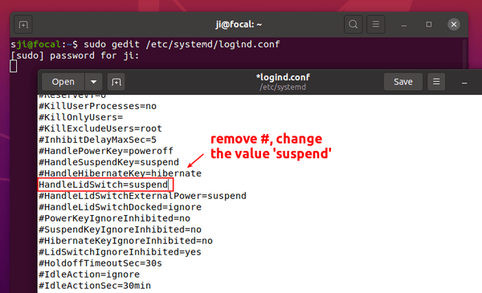

<span id="contents"></span>
# linuxSetting
<a href="#contents">

* Contents
  * 安裝環境
    * [修改apt-get镜像源](#apt)
  * [支援網頁播放視頻](#video)
  * [安裝CMake](#cmake)
  * [安裝Qt](#Qt)
  * [Kdiff3安裝](#kdiff3)
  * [pandoc安裝](#pandoc)
  * [安裝GPU](#nvidia)
    * [NIVIDA driver breaks build-in audio](#audio_break)
    * [修改gcc和g++使得nvcc的版本兼容](#gcc)
    * 更換cuda版本
    * [Conda環境安裝cuda和cudnn](#conda)
      * 查看Conda ENV python 版本
    * [解除安裝cuda](#uninstall_cuda)
  * [安裝OpenCV和Ceres](#opencv)
  * [偵測USB相機編號](#webcam)
  * [源碼解安裝](#makeuninstall)
  * [git 操作](#git)
  * [docker 操作](#docker)
  * [vscode 套件安装和设定](#vscode)
  * [安装rvm和修复Cocoapods](#rvm)
  * [Ubuntu 安装 Apple Sillicon](#arm)
  * [制作USB开机磁盘](#usb_boot)
  * [基本操作，參考實驗樓《Linux基礎入門》](#shiyanlou)

Linux
----
 * 安裝環境
```shell
#----重灌系統的第一步，在安裝所有驅動前最好先更新！
sudo apt-get update -qq && sudo apt-get upgrade -y
sudo apt-get install build-essential #install make
sudo apt-get install g++
#----安裝智能拼音
sudo apt-get install ibus-libpinyin

#------安裝小畫家
sudo apt-get install kolourpaint #記得別裝到kolourpaint4，是舊版
#------顯示已安裝的列表
sudo dpkg --get-selections
```
[Ubuntu install Chewing](https://medium.com/@racktar7743/ubuntu-%E5%9C%A8-ubuntu-18-04-%E4%B8%AD%E6%96%B0%E5%A2%9E%E6%96%B0%E9%85%B7%E9%9F%B3%E8%BC%B8%E5%85%A5%E6%B3%95-4aa85782f656)

* #### 掛載其他硬盤
[參考資料](https://www.simplified.guide/linux/disk-mount), [Ask Ubuntu](https://askubuntu.com/questions/205841/how-do-i-mount-a-folder-from-another-partition)
這裏的範例是安裝了兩個ubuntu系統，系統keroro掛載系統cia1099的資料，cia1099裝在`/dev/sda3`：
```shell
df -h # 檢查可掛的硬盤
#----要先將硬盤掛載到指定的資料夾，這樣才能指定出路徑，製造鍵結
cd ~
mkdir -p disk
sudo vi /etc/fstab
#Add an entry for a new mount point
/dev/sda3       /home/keroro/disk ext4    defaults        0       2
# exit vim
sudo mount -a
ln -s /home/keroro/disk/home/cia1099/project/ /home/keroro/
```

* ####  [.bashrc](bashrc/.bashrc)範例：
**注意**:如果你在安裝一個軟件之後，無法立即使用`Tab`鍵補全這個命令，你可以嘗試先執行`source ~/.zshrc`(在我本地ubuntu只見到`~/.bashrc`)，然後你就可以使用補全操作。
```shell
export CUDA_HOME=/usr/local/cuda
export LD_LIBRARY_PATH=/usr/local/cuda/lib64
export PATH=$PATH:$CUDA_HOME/bin
export LD_LIBRARY_PATH=$LD_LIBRARY_PATH:/usr/local/lib


export NVM_DIR="$HOME/.nvm"
[ -s "$NVM_DIR/nvm.sh" ] && \. "$NVM_DIR/nvm.sh"  # This loads nvm
[ -s "$NVM_DIR/bash_completion" ] && \. "$NVM_DIR/bash_completion"  # This loads nvm bash_completion

# <<< Qt6
export PATH=$PATH:/home/keroro/Program_Files/Qt6/build/qtbase/bin
export LD_LIBRARY_PATH=$LD_LIBRARY_PATH:/home/keroro/Program_Files/Qt6/build/qtbase/lib
export QT_QPA_PLATFORM_PLUGIN_PATH=/home/keroro/Program_Files/Qt6/build/qtbase/plugins/platforms

# <<< sdkmanager
#ref. https://linoxide.com/install-android-sdk-manager-ubuntu/
# https://stackoverflow.com/questions/49507160/how-to-install-jdk-10-under-ubuntu
# https://jdk.java.net/archive/
export PATH=$PATH:/home/keroro/Program_Files/Android/Sdk/tools/bin:/home/keroro/Program_Files/Android/Sdk/tools
```

* [How to list all programs installed that were compiled from source?](https://askubuntu.com/questions/493308/how-to-list-all-programs-installed-that-were-compiled-from-source)

##### [How to Change Lid Close Behavior in Ubuntu 20.04](https://ubuntuhandbook.org/index.php/2020/05/lid-close-behavior-ubuntu-20-04/)
修改筆電闔上屏幕的動作，使用指令
```shell
sudo gedit /etc/systemd/logind.conf
```
修改`.conf`的`HandLidSwitch`內容對應的動作如下：

* HandleLidSwitch=lock – lock when lid closed.
* HandleLidSwitch=ignore – do nothing.
* HandleLidSwitch=poweroff – shutdown.
* HandleLidSwitch=hibernate – hibernate Ubuntu.

<div aligned=center>

</img>

注意要將該行註釋取消掉
</div>

修改`.conf`完成後，要應用該變化需要輸入
```shell
systemctl restart systemd-logind.service
```

#### [Remove grub in boot](https://www.binaryera.com/2020/08/RemoveGrubFromWindow10.html?m=1)

---
* 檢查安裝包

#### 1. [APT HowTo](https://www.debian.org/doc/manuals/apt-howto/index.zh-cn.html#contents)

```shell
'''
apt-cache 命令則是針對本地數據進行相關操作的工具，
search 顧名思義在本地的數據庫中尋找有關softname相關軟件的信息
'''
apt-cache search all | grep [softname]
apt-cache search all
apt-cache search [softname]
# 更新軟件源，保持本地的軟件包列表是最新的
sudo apt-get update
# 升級沒有依賴問題的軟件包
sudo apt-get upgrade
# 升級並解決依賴關係
sudo apt-get dist-upgrade
```
表apt-get工具
|工具|說明|參數|說明|
|---|---|---|---|
install|其後加上軟件包名，用於安裝一個軟件包|-y|	自動回應是否安裝軟件包的選項，在一些自動化安裝腳本中使用這個參數將十分有用
update|從軟件源鏡像服務器上下載/更新用於更新本地軟件源的軟件包列表|-s|模擬安裝
upgrade|升級本地可更新的全部軟件包，但存在依賴問題時將不會升級，通常會在更新之前執行一次update|-q|靜默安裝方式，指定多個q或者-q=#,#表示數字，用於設定靜默級別，這在你不想要在安裝軟件包時屏幕輸出過多時很有用
dist-upgrade|解決依賴關係並升級(存在一定危險性)|-f|修復損壞的依賴關係
remove|移除已安裝的軟件包，包括與被移除軟件包有依賴關係的軟件包，但不包含軟件包的配置文件|-d|只下載不安裝
autoremove|移除之前被其他軟件包依賴，但現在不再被使用的軟件包|--reinstall|重新安裝已經安裝但可能存在問題的軟件包
purge|與 remove 相同，但會完全移除軟件包，包含其配置文件|--install-suggests|同時安裝 APT 給出的建議安裝的軟件包
clean|移除下載到本地的已經安裝的軟件包，默認保存在/var/cache/apt/archives/
autoclean|移除已安裝的軟件的舊版本軟件包

移除軟件時順序是先`remove`或`remove --purge`(順帶移除配置文件) [軟件名]，然後才再用`autoremove`刪除依賴的軟件包。
* 刪除安裝包
```shell
# 不保留配置文件的移除
sudo apt-get purge [安裝包名]
# 或者 sudo apt-get remove --purge
# 移除不再需要的被依赖的软件包
sudo apt-get autoremove
##======不同時空下查的資料，上述是實驗樓的資料
sudo apt-get --purge remove [安裝包名] #刪除單一包，包含配置文檔
 sudo apt-get autoremove [安裝包名] #刪除安裝包與相依包
```
使用`apt-get -d install [軟件名]`；下載不安裝的所有相依軟件會下載到`/var/cache/apt/archives/`目錄底下。

<span id="apt"></span>
* #### 修改`apt-get`镜像源
例如将tw的源改为us：
```shell
sudo rm -rf /var/lib/apt/lists/*
sudo apt-get clean
sudo sed -i 's/http:\/\/tw./http:\/\/us./g' /etc/apt/sources.list
```
ref. https://askubuntu.com/questions/104695/how-do-i-change-mirrors-in-ubuntu-server-from-regional-to-main
#### 2. dpkg
我們經常可以在網絡上見到以deb形式打包的軟件包，就需要使用dpkg命令來安裝。然而，直接使用 dpkg 安裝可能會存在一些問題，因為dpkg並不能為你解決依賴關係；遇到缺少依賴包問題可以使用`apt-get install -f`修復。
```shell
dpkg -l #完整
dpkg -l 軟件名
whereis 軟件名
dpkg -l | grep ftp
dpkg --get-selections | grep 軟件名 #顯示軟件已安裝
```
|參數|說明|
|---|---|
-i|安裝指定 deb 包
-R|後面加上目錄名，用於安裝該目錄下的所有 deb 安裝包
-r|remove，移除某個已安裝的軟件包
-I|顯示deb包文件的信息
-s|顯示已安裝軟件的信息
-S|搜索已安裝的軟件包
-L|顯示已安裝軟件包的目錄信息

**注意**：現在新版的Linux系統的`apt`可支援安裝.deb檔案了，請參考[VScode安裝辦法](https://code.visualstudio.com/docs/setup/linux)
```shell
sudo apt install ./<file>.deb

# If you're on an older Linux distribution, you will need to run this instead:
# sudo dpkg -i <file>.deb
# sudo apt-get install -f # Install dependencies
```
#### 3. 從二進制包安裝
二進制包的安裝比較簡單，我們需要做的只是將從網絡上下載的二進制包解壓後放到合適的目錄，然後將包含可執行的主程序文件的目錄添加進PATH環境變量即可，如果你不知道該放到什麼位置，請重新複習實驗樓第五節關於 Linux 環境變量。

<span id="video"></span>
### 支援網頁播放視頻
If those streaming services use DRM, you must enable DRM in Firefox's settings: Preferences -> General -> Play DRM-controlled content You might also have to install package libavcodec-extra to get the codecs:
```
sudo apt install libavcodec-extra
```
[Playing Videos in Firefox](https://askubuntu.com/questions/1035661/playing-videos-in-firefox)

<span id="cmake"></span>
* 安裝CMake
```shell
wget https://cmake.org/files/v3.15/cmake-3.15.6.tar.gz 
tar xzvf cmake-3.15.6.tar.gz
sudo apt-get install libncurses5-dev #in order to install ccmake 
cd cmake-3.15.6
cmake -D BUILD_CursesDialog=ON
# Don't forget openssl
sudo apt-get install libssl-dev
./bootstrap --qt-gui
# if qt-gui fail, check this command
#sudo apt-get install qtbase5-dev #in order build qtbase cmake
make -j8
make install
```
[返回目錄](#contents)

* 圖形介面
##### 注意要先安裝Xming或VCXrc
```shell
sudo apt install xfce4 xfce4-terminal  #注意命令里是xfce不是xface
echo "export DISPLAY=:0" >> ~/.bashrc
source ~/.bashrc
echo $DISPLAY  # 检验一下
startxfce4  # 启动
```
<span id="Qt"></span>
## Qt安裝
直接去github下載源碼，不要去官網註冊和下載。

編譯**Qt**之前需要先安裝的[libraries](https://wiki.qt.io/Building_Qt_5_from_Git):
* Libxcb:
`sudo apt-get install '^libxcb.*-dev' libx11-xcb-dev libglu1-mesa-dev libxrender-dev libxi-dev libxkbcommon-dev libxkbcommon-x11-dev`
* Qt Multimedia:
`sudo apt-get install libasound2-dev libgstreamer1.0-dev libgstreamer-plugins-base1.0-dev libgstreamer-plugins-good1.0-dev`
注意安裝`libgstreamer-plugins-bad1.0-dev`會包含`libopencv`預編譯版本，所以不要裝。
* QDoc Documentation Generator Tool:
`sudo apt install libclang-6.0-dev llvm-6.0`
* Qt WebEngine:
`sudo apt-get install libxcursor-dev libxcomposite-dev libxdamage-dev libxrandr-dev libxtst-dev libxss-dev libdbus-1-dev libevent-dev libfontconfig1-dev libcap-dev libpulse-dev libudev-dev libpci-dev libnss3-dev libasound2-dev libegl1-mesa-dev`

```shell
git clone --depth=1 --branch=v6.2.1 --recursive https://github.com/qt/qt5.git
mv qt5 Qt6
cd Qt6
perl init-repository #如果有做recursive可以不用initial
cmake -HQt6 -BQt6/build
cmake --build Qt6/build -t install -j$(($(nproc)/2))
#預設CMAKE_INSTALL_PREFIX=${CMAKE_BINARY_DIR}/qtbase
```

### [Qt for Android](https://doc-snapshots.qt.io/qt6-6.2/android-building.html)

* 安裝**JDK**
[sdkmanager參考步驟](https://linoxide.com/install-android-sdk-manager-ubuntu/)
[參考安裝舊版本](https://stackoverflow.com/questions/49507160/how-to-install-jdk-10-under-ubuntu)，去[JDK](https://jdk.java.net/archive/)官網下載舊版本。
```shell
#1. 最簡單安裝，但版本會是新版
sudo apt-get install default-jdk
#2. 安裝舊版本
tar -xzf openjdk-10_linux-x64_bin.tar.gz
sudo mv jdk-10 /usr/lib/jvm/java-10-openjdk-amd64/
sudo update-alternatives --install /usr/bin/java java /usr/lib/jvm/java-10-openjdk-amd64/bin/java 10
sudo update-alternatives --install /usr/bin/javac javac /usr/lib/jvm/java-10-openjdk-amd64/bin/javac 10
```
* 安裝**NDK**
1. 直接用**Android Studio**下載並安裝對應的版本，e.g. Qt **6.2.1**對應的版本是`21.3.6528147`，`android-30`
2. 設定環境變數`~/.bashrc`
```shell
# <<< Qt6
export JAVA_HOME=/usr/lib/jvm/java-10-openjdk-amd64
export PATH=$PATH:$JAVA_HOME/bin
# <<< sdkmanager
export PATH=$PATH:/home/keroro/Program_Files/Android/Sdk/tools/bin:/home/keroro/Program_Files/Android/Sdk/tools
```
3. 將`/path/to/src/Qt6/qtbase/CMakeLists.txt`的一段關於`examples`部份註解掉，因為後面Config不知道為啥出錯：
```shell
qt_build_repo_end()
#---- at EOF ~ line 175 
if(NOT QT_BUILD_STANDALONE_TESTS AND QT_BUILD_EXAMPLES)
    #add_subdirectory(examples) <----註解掉
endif()
```
4. 注意CMake的版本要大於`3.21.x`以上，才有支援`DCMAKE_TOOLCHAIN_FILE`的[Flag](https://developer.android.com/ndk/guides/cmake)。
參考[cmake-toolchains](https://cmake.org/cmake/help/latest/manual/cmake-toolchains.7.html)
5. 開始編譯：
`QT_HOST_PATH`為前面Qt安裝的路徑。
```shell
cd /path/to/src/Qt6
cmake -DQT_BUILD_TOOLS_WHEN_CROSS_COMPILING=ON -DQT_HOST_PATH=/home/keroro/Program_Files/Qt6/build/qtbase \
-DCMAKE_INSTALL_PREFIX=/home/keroro/Program_Files/Qt6/build/android \
-DWARNINGS_ARE_ERRORS=OFF -DQT_QMAKE_TARGET_MKSPEC=android-clang -DANDROID_SDK_ROOT=/home/keroro/Program_Files/Android/Sdk -DANDROID_NDK_ROOT=/home/keroro/Program_Files/Android/Sdk/ndk/21.3.6528147 -DQT_BUILD_TESTS=OFF -DQT_BUILD_EXAMPLES=OFF \
-DCMAKE_ANDROID_ARCH_ABI=x86_64 -DCMAKE_SYSTEM_NAME=Android -DANDROID_PLATFORM=30 -DANDROID_ABI=x86_64 \
-DCMAKE_TOOLCHAIN_FILE=/home/keroro/Program_Files/Android/Sdk/ndk/21.3.6528147/build/cmake/android.toolchain.cmake \
-H. -Bandroid-build -GNinja

cmake --build andorid-build -t install -j$(($(nproc)/2))
```
注意一定要確認**config**是哪個平台的建置，需要仔細設定`ANDROID_ABI`、`CMAKE_ANDROID_ARCH_ABI`到底是建置哪個平台，不然會被設置為預設值。`ANDROID_PLATFORM`、`CMAKE_SYSTEM_NAME`好像就沒關係，toolchain會自動偵測。

將所有編譯**Android**的庫，藉由參數`CMAKE_INSTALL_PREFIX`集中放在統一路徑，方便管理和後續的連結。

### Qt Creator
1. 下載官方版本的[llvm/clang](https://github.com/qt-creator/qt-creator#getting-llvmclang-for-the-clang-code-model)來編譯
```shell
git clone -b release_110-based --depth=1 --recursive https://code.qt.io/clang/llvm-project.git
cd llvm-project
cmake \
  -D CMAKE_BUILD_TYPE=Release \
  -D LLVM_ENABLE_RTTI=ON \
  -D LLVM_ENABLE_PROJECTS="clang;clang-tools-extra" \
  -D CMAKE_INSTALL_PREFIX=/home/keroro/Program_Files/qt-creator/llvm \
  -Hllvm -Bbuild
```
2. 開始編譯qt-creator
記得包含前面建置出來的android庫，和包含原始Qt編譯出來的主要庫
```shell
git clone --depth=1 --branch=v5.0.3 https://github.com/qt-creator/qt-creator.git
cd qt-creator
cmake -DCMAKE_BUILD_TYPE=Debug -GNinja "-DCMAKE_PREFIX_PATH=/home/keroro/Program_Files/Android;/home/keroro/Program_Files/qt-creator/llvm;/home/keroro/Program_Files/Qt6/build/qtbase" -H. -Bbuild
```
3. 開啟qtcreator

就會出現**Android Kits**。

[返回目錄](#contents)

* VTK安裝
直接使用apt-get安裝：
'sudo apt-get install libvtk7-dev'
要注意dash（-）後有dev的才有包含header可以做編譯，最好都安裝帶有-dev的安裝包。
在安裝VTK包時，會遇到相依性衝突，這大部分是libboost安裝包版本衝突造成，先刪除舊版libboost安裝包，
直接安裝VTK會自動安裝相應的相依libboost版本包，之後再依對應的版本安裝完整的libboost包即可。
```shell
sudo apt-get install libglu1-mesa-dev freeglut3-dev mesa-common-dev #安裝OpenGL
sudo apt-get install doxygen #文檔生成庫

cmake -DCMAKE_INSTALL_PREFIX=/usr/local \
      -DCMAKE_BUILD_TYPE=Release \
      -DVTK_QT_VERSION:STRING=5 \
      -DQT_QMAKE_EXECUTABLE:PATH=/opt/Qt5.11.3/5.11.3/gcc_64/bin/qmake \
      -DVTK_GROUP_ENABLE_Qt:STRING=YES \
      -DCMAKE_PREFIX_PATH:PATH=/opt/Qt5.11.3/5.11.3/gcc_64/lib/cmake  \
      -DBUILD_SHARED_LIBS:BOOL=ON \
      -DVTK_FORBID_DOWNLOADS:BOOL=ON \
      -DVTK_BUILD_DOCUMENTATION:BOOL=ON \
      -DVTK_PYTHON_VERSION-STRINGS=3 \
      ..
```

* PCL安裝
```shell
sudo apt-get install  libboost-all-dev libeigen3-dev libflann-dev libusb-1.0-0-dev

cmake -DCMAKE_INSTALL_PREFIX=/usr/local \
-DCMAKE_BUILD_TYPE=Release \
-DCMAKE_PREFIX_PATH:PATH=/opt/Qt5.11.3/5.11.3/gcc_64/lib/cmake  \
-DQt5_DIR:PATH=/opt/Qt5.11.3/5.11.3/gcc_64 \
-DBUILD_SHARED_LIBS:BOOL=ON \
-DBUILD_examples:BOOL=ON \
-DQT5_QMAKE_EXECUTABLE:PATH=/opt/Qt5.11.3/5.11.3/gcc_64/bin/qmake \
..

#----- 直接 apt-get 安裝
sudo apt-get install -y libpcl-dev pcl-tools
#===========
#安裝octomap
sudo apt-get install liboctomap-dev octovis
```

* WSL文件位置
如果想在 Linux 查看其他分区，WSL 将其它盘符挂载在 /mnt 下。
如果想在 Windows 下查看 WSL 文件位置，文件位置在：C:\Users\用户名\AppData\Local\Packages\CanonicalGroupLimited.Ubuntu18.04onWindows_79rhkp1fndgsc\LocalState\rootfs 下。

* 系統環境變量(待續)
```shell
### 查看環境變量
env | grep PATH
echo $PATH
```
<span id="kdiff3"></span>
#### Kdiff3安裝
先去官網下載Kdiff3的tar.gz檔案，準備編譯環境，這裡是<span style="background-color:yellow">只裝Qt版的</span>
```shell
sudo apt-get install gettext qtbase5-dev qt5-qmake
tar zxvf kdiff.tar.gz
./config qt4 #就算沒裝qt4，只裝了qt5，也是建置qt5的版本
# 安裝語言包
cd .../kdiff3-0.9.98/po
sh create_qm_files install
sh create_qm_files local #上面失敗就再加這句

#編輯 .gitconfig
code /home/cia1099/.gitconfig
### 編輯範例：
[difftool "kdiff3"]
	cmd = '/home/cia1099/Downloads/kdiff3-0.9.98/releaseQt/kdiff3' \"$LOCAL\" \"$REMOTE\"
[mergetool "kdiff3"]
	cmd = '/home/cia1099/Downloads/kdiff3-0.9.98/releaseQt/kdiff3' \"$BASE\" \"$LOCAL\" \"$REMOTE\" -o \"$MERGED\"
```
##### 建立執行檔連結捷近
1. 首先將所要連結的執行檔改變權限，使得該執行檔可執行
2. 創建連結並將之移到`/usr/bin/`目錄裡
3. 注意在`/usr/bin/`底下都依檔名來決定終端所操作的執行命令名稱
4. [注意`ln`的使用方法](https://askubuntu.com/questions/56339/how-to-create-a-soft-or-symbolic-link): `sudo ln -s /<full>/<path>/<to>/<file> /usr/local/bin`
```shell
cd /home/cia1099/Downloads/kdiff3-0.9.98/releaseQt/
# 加"a"使得"ll"是否已經顯示 kdiff3* 表示已經可以直接 kdiff3執行，不用./kdiff3 執行
sudo chmod a+x kdiff3
#-------方法1
ln -s kdiff3 link_to_kdiff3
sudo mv link_to_kdiff3 /usr/bin
sudo mv /usr/bin/link_to_kdiff3 /usr/bin/kdiff3 #rename
#-------方法2
sudo ln -s /home/cia1099/Downloads/kdiff3-0.9.98/releaseQt/kdiff3 /usr/local/bin
```

[返回目錄](#contents)

<span id="pandoc"></span>
#### Pandoc安裝
安裝pandoc不要用apt-get安裝，預編譯版本過舊，[直接在官網下載最新.deb](https://github.com/jgm/pandoc/releases/)
```shell
sudo dpkg -i $DEB_PATH
#讓pandoc支援latex
sudo apt-get -y install texlive-latex-recommended texlive-pictures texlive-latex-extra
#eample md to pdf
pandoc -V geometry:margin=0.5in -V linestrech:1.5 bk_ans.md --pdf-engine=xelatex -o 2_ans.pdf
#當 --pdf-engine=xelatex失靈時
pandoc -V geometry:margin=0.5in -V linestrech:1.5 3_ans.md -o 3_ans.pdf
```
pandoc 相關格式與參數設定可參考：
1. [stack overflow](https://stackoverflow.com/questions/13515893/set-margin-size-when-converting-from-markdown-to-pdf-with-pandoc)
2. [pandoc for pdf howTo](https://github.com/alexeygumirov/pandoc-for-pdf-how-to)
3. [LaTeX公式编辑器](https://latexlive.com/)

[返回目錄](#contents)

<span id="nvidia"></span>
#### 安裝GPU
現在安裝系統都已經有顯示卡的ppa，因此直接輸入以下指令就能直接裝好所有驅動：
```
sudo ubuntu-drivers autoinstall
```
参考：https://askubuntu.com/questions/1033785/external-monitor-not-detected-on-ubuntu-18-04

有時候直接用上述指令會系統崩潰，這時還是要下述步骤來安裝驅動。

[reference](https://gitpress.io/@chchang/install-nvidia-driver-cuda-pgstrom-in-ubuntu-1804)
[Official](https://gist.github.com/wangruohui/df039f0dc434d6486f5d4d098aa52d07)
```shell
# 新的ubuntu都已經有ppa和ubuntu-drivers
sudo add-apt-repository ppa:graphics-drivers/ppa
sudo apt update
sudo apt install ubuntu-drivers-common

ubuntu-drivers devices #看現在的驅動程式狀態
sudo apt install nvidia-driver-440 
sudo reboot
lsmod|grep nvidia #查看基本資訊，無顯示表示沒有成功載入驅動
nvidia-smi #查看GPU資訊
nvidia-modprobe #將驅動手動啟動載入至系統
```
<font color=ff00>如果找不到驅動，要將BIOS的Secure Boot設為Disable</font>
而萬一你錯過了[MOK](https://clay-atlas.com/blog/2022/04/30/nvidia-smi-failed-communicate/)的畫面、並且在下次重新啟動時也沒有進入 MOK 畫面，或許你可以執行以下指令來重新進行這些程序：
```shell
sudo mokutil --import /var/lib/shim-signed/mok/MOK.der
```
##### MOK 畫面時的操作步驟
1. 在配置安全啟動（configure secure boot）時設定密碼，並記起密碼
2. 當你進入 Perform MOK management 畫面時，請選擇 Enroll MOK > Continue > Yes
3. 在 Enroll the key(s)? 畫面時，輸入剛才步驟 1. 的密碼。
4. 選擇 OK 重新啟動
5. 在重新啟動後，使用 nvidia-smi 指令確認驅動程式已經正常運作

* ##### 安裝CUDA
同樣採用官網下載deb 回來安裝的方法
到這邊 https://developer.nvidia.com/cuda-downloads 
選擇 Linux -- x86_64 -- Ubuntu -- 18.04 -- deb(local)
畫面上就會有安裝步驟，照著做就沒問題了
一樣，安裝完成後重新開機，然後來編譯一個 deviceQuery 的小程式來看看資訊
```shell
cd /usr/local/cuda-10.2/samples/1_Utilities/deviceQuery
sudo make
```
會產生一個叫 deviceQuery 的執行檔，執行後，會有相關資訊
* ##### 安裝cuDNN
The recommended way for installing cuDNN is to first copy the `tgz` file to `/usr/local` and then extract it, and then remove the `tgz` file if necessary. This method will preserve symbolic links. At last, execute `sudo ldconfig` to update the shared library cache.

* 讓vcpkg支援CUDA
https://github.com/microsoft/vcpkg/issues/8247
```shell
cd vcpkg
export CUDA_PATH=/usr/local/cuda;
export CUDA_BIN_PATH=/usr/local/cuda/bin;
./vcpkg install cuda
```

* ##### 鎖定`nvidia driver`和`cuda driver`版本
[How do I hold all updates related to nvidia driver](https://askubuntu.com/questions/631453/how-do-i-hold-all-updates-related-to-nvidia-346-72-driver)
```
sudo apt-mark hold nvidia-driver-460 cuda-driver-dev-11-2 
# 解除鎖定
sudo apt-mark unhold nvidia-driver-460 cuda-driver-dev-11-2
```
[返回目錄](#contents)

--- 
<span id="audio_break"></span>
* #### NIVIDA driver breaks build-in audio
* https://pov.es/linux/ubuntu-ubuntu-20-4-installing-nvidia-drivers-breaks-built-in-audio-on-laptop/
* [比較沒用的參考](https://www.linuxuprising.com/2018/06/fix-no-sound-dummy-output-issue-in.html)

當安裝好顯卡驅動後，發現沒有聲音，先查詢音效卡的狀態，然後找出該音效卡所用的[codec](https://www.infradead.org/~mchehab/rst_conversion/sound/hd-audio/models.html)，在編輯所對應的`/etc/modprobe.d/alsa-base.conf`alsa檔案。
```shell
# 查詢多媒體卡的狀態
lshw -c multimedia
# 查看audio的driver是否為snd_hda_intel
lspci -nnk | grep -A2 Audio
# 查看音效卡所使用的codec，要注意`/proc/asound/`目錄下`card`的編號，找到編號廠商為Realtek
head /proc/asound/card0/codec*
# 在網站(codec)雖然找到ALC1220對應的是dual-codecs，但不知道為啥不能啟用，然而用下一個`clevo-p950`卻成功了，很神奇卻也很鳥。編輯alas檔：
echo "options snd-hda-intel model=clevo-p950" | sudo tee -a /etc/modprobe.d/alsa-base.conf
echo "options snd-hda-intel probe_mask=0x1" | sudo tee -a /etc/modprobe.d/alsa-base.conf
# index 要輸入號碼是card的幾號
echo "options snd-hda-intel index=0" | sudo tee -a /etc/modprobe.d/alsa-base.conf
```
<span id="gcc"></span>
#### 修改gcc和g++使得nvcc的版本兼容
[參考連結](https://linuxconfig.org/how-to-switch-between-multiple-gcc-and-g-compiler-versions-on-ubuntu-20-04-lts-focal-fossa)

因為cuda的版本會限制編譯器的版本，因此要編譯cuda需要對應版本的編譯器，所以要安裝該版本的編譯器，並將預設的編譯器修改成該對應的版本：
```shell
#以cuda10.2為例，該版本編譯器為gcc-8
sudo apt-get install gcc-8 g++-8
sudo update-alternatives --install /usr/bin/gcc gcc /usr/bin/gcc-8 8
sudo update-alternatives --install /usr/bin/g++ g++ /usr/bin/g++-8 8 #其中8表示priority
```
使用`sudo update-alternatives --config gcc`切換預設編譯器版本

使用`sudo update-alternatives --remove /usr/bin/gcc-8 gcc`刪除版本選項，如果priority設錯的話可以這樣修改

#### 更換cuda版本
[查看cuda支持gcc版本](https://stackoverflow.com/questions/6622454/cuda-incompatible-with-my-gcc-version)
```shell
# 檢查cuda所連結的版本
ll /usr/local |grep cuda
# 支持切换cuda
sudo update-alternatives --install /usr/local/cuda cuda /usr/local/cuda-10.2 10
sudo update-alternatives --config cuda
```

[返回目錄](#contents)

<span id="conda"></span>
* ### Conda環境安裝cuda和cudnn

conda環境要安裝cuda可以直接用conda預編譯好的安裝包，安裝即可
```shell
conda search cudatoolkit #查看conda提供的安裝版本
conda install cudatoolkit=11 #安裝cuda11
```
安裝`cudnn`直接拿官網下載的壓縮包，解壓後再複製至你要安裝的conda之env
```shell
sudo cp cuda/include/cudnn*.h   /miniconda3/envs/<your environment here>/include
sudo cp cuda/lib64/libcudnn*    /miniconda3/envs/<your environment here>/lib
```

* #### 查看Conda ENV python 版本
[參考資料](https://stackoverflow.com/questions/43168264/which-python-version-is-installed-in-another-conda-env)
```shell
conda env list | grep -v "^$\|#" |awk '{print $1;}'|xargs -I{} -d "\n" sh -c 'printf "Env: {}\t"; conda list -n {} |grep "^python\s";'
```

[返回目錄](#contents)

<span id="uninstall_cuda"></span>
* ### 解除安裝cuda
通常`cuda`是用dpkg安裝的，所以要一直用`dpkg -l|grep cuda`檢查安裝與解安裝與否，[可以參考](https://askubuntu.com/questions/959835/how-to-remove-cuda-9-0-and-install-cuda-8-0-instead)。
要解安裝cuda要重複輸入指令：
```shell
# 刪除含有cuda的搜尋結果在dpkg -l
dpkg -l|grep cuda|awk '{print $2}' | xargs -n1 sudo dpkg -r

# --- 重複上述步驟，因為會有相依性，刪除會失敗
# 所以用 dpkg -l|grep cuda 檢查開頭是否為 'ii'還是'rc'
# ii 表示已安裝， rc 表示以刪除還留下config檔
# 等列表全部顯示為 rc 後在輸入：
dpkg -l|grep cuda|awk '{print $2}' | xargs -n1 sudo dpkg --purge

```

<span id="opencv"></span>
### 安裝OpenCV
[安裝參考](https://blog.gtwang.org/programming/ubuntu-linux-install-opencv-cpp-python-hello-world-tutorial/)
```shell
sudo apt-get install libopencv-dev libopencv-contrib-dev
"""
注意要安裝"libopencv-dev"，只裝"contrib"CMake找不到package
"""
# 安裝Eigen
sudo apt-get install libeigen3-dev
```
安裝[GDB-imagewatch](https://github.com/csantosbh/gdb-imagewatch)

注意套件的安裝路徑不要忘了，不然難以朔源，範例安裝位置：`/home/cia1099/Downloads/gdb-imagewatch/installFolder/<自動生成資料夾名>/`，在該資料夾下要看到`gdb-imagewatch.py`腳本

#### 安裝Ceres
先安裝依賴項：
```shell
sudo apt-get install liblapack-dev libsuitesparse-dev libcxsparse3 libgflags-dev libgoogle-glog-dev libgtest-dev
```
再去github抓[Ceres](https://github.com/ceres-solver/ceres-solver)作cmake編譯安裝。

<span id="webcam"></span>
#### 偵測USB相機編號
每一個usb都會對應一個編號的device，預設的相機即`device0`為屏幕上的相機，而要查詢以USB新增的相機輸入以下指令：
```shell
lsusb
'''
lsusb會輸出各項device的編號、廠商等，找到ID項目
然後輸入下面指令，假設看到某項ID編號為(0408:5300)
'''
lsusb -v -d 0408:5300 |grep -i serial
```
然後就可以看到該ID設備的`iSerial`編號了。
[參考資料](https://superuser.com/questions/902012/how-to-identify-usb-webcam-by-serial-number-from-the-linux-command-line)


[返回目錄](#contents)

<span id="makeuninstall"></span>
#### 源碼解安裝
參考資料：
1. https://stackoverflow.com/questions/1439950/whats-the-opposite-of-make-install-i-e-how-do-you-uninstall-a-library-in-li

2. https://gist.github.com/ruario/a36052a1ae1de4edbc6ad39fe39e5385

注意在編譯源碼後要進行`sudo make install`前先確認有沒有`make uninstall`專案指令，如果沒有最好採用`checkinstall`指令來建立`.deb`軟件包來安裝。如果不小心已經`make install`了，就利用`install_manifest.txt`方法來手動刪除安裝文件。

* ##### Method: checkinstall -- only for debian based systems
```shell
sudo apt-get -y install checkinstall
cd $SOURCE_DIR 
sudo checkinstall
sudo dpkg -i $PACKAGE_NAME_YOU_ENTERED 
sudo dpkg -r $PACKAGE_NAME_YOU_ENTERED
```
* ##### Method: install_manifest.txt
```shell
# 檢查安裝的文件是否存在
cd $SOURCE_DIR 
sudo xargs -I{} stat -c "%z %n" "{}" < install_manifest.txt

# 將安裝的文件移動到 deleted-by-uninstall 文件夾
mkdir deleted-by-uninstall
sudo xargs -I{} mv -t deleted-by-uninstall "{}" < install_manifest.txt
```
執行完移動安裝文件後，就可以`make clean`然後再刪除安裝文件所在的資料夾後，再刪除整個源碼資料夾即可。

##### CMakeLists 添加解安裝target
參考資料：
1. https://stackoverflow.com/questions/41471620/cmake-support-make-uninstall
2. https://gitlab.kitware.com/cmake/community/-/wikis/FAQ#can-i-do-make-uninstall-with-cmake

在 top-level 的`CMakeLists.txt`裡添包含[cmake_uninstall.cmake.in](cmake/cmake_uninstall.cmake.in)的CMake模組，例如：
```cmake
# uninstall target
if(NOT TARGET uninstall)
  configure_file(
    "${CMAKE_CURRENT_SOURCE_DIR}/cmake_uninstall.cmake.in"
    "${CMAKE_CURRENT_BINARY_DIR}/cmake_uninstall.cmake"
    IMMEDIATE @ONLY)

  add_custom_target(uninstall
    COMMAND ${CMAKE_COMMAND} -P ${CMAKE_CURRENT_BINARY_DIR}/cmake_uninstall.cmake)
endif()

# -----
# 或是直接將cmake_uninstall.camke.in放到CMAKE_MODULE_PATH
# 指定的資料夾裡面，也會生成uninstall target
# -----
list(APPEND CMAKE_MODULE_PATH ${PROJECT_SOURCE_DIR}/cmake)
# cmake_uninstall.cmake.in 存在於${PROJECT_SOURCE_DIR}/cmake/ 路徑下
```
這樣就使得make有uninstall的build選項。


<span id="git"></span>
#### Git 操作
<a href="#git">
Contents</a>

* [clone 子文件夾](#clone_sub)

<span id="clone_sub"></span>
##### clone 子資料夾
[參考stack overflow](https://stackoverflow.com/questions/600079/how-do-i-clone-a-subdirectory-only-of-a-git-repository/52269934#52269934)

E.g., to clone only objects required for 'chapter-10' of this minimal test repository: https://github.com/dev-cafe/cmake-cookbook.git I can do:
```shell
git clone \
  --depth 1  \
  --filter=blob:none  \
  --sparse \
  https://github.com/dev-cafe/cmake-cookbook.git \
;
cd cmake-cookbook
git sparse-checkout add chapter-10
# 显示sparse
git sparse-checkout list
# 删除sparse
git sparse-checkout set ''
rm -rf chapter-10
```
##### git remote new branch to track
当clone只有单独一个分支的话，`origin`只有追踪当初clone的那个分支，因此需要新增一个新的remote来追踪别的分支
```shell
git remote add -t <branch> <remote_name> <url>
# git remote add -t plugin plugin git@gitlab.com:payneDong/im_common.git
# This will show all remotes
git remote -v
git fetch --depth=1 <remote_name>
```
##### pull & push
当本地的分支名称和远程的名称不同时，可以加上`:`来指定拉下/推上的分支名，在特定的远程专案。这样就不用再加一个remote个别管理branch了。
```shell
git pull <remote_name> <remote_branch>:<local_branch>
git push -u <remote_name> <local_branch>:<remote_branch>
# 删除远程分支
git push -d <remote_name> <remote_name>
```
https://stackoverflow.com/questions/19154302/git-push-to-specific-branch

##### git merge
[git merge visualization](https://dev.to/lydiahallie/cs-visualized-useful-git-commands-37p1)
* 直接在合并时强迫优先那个分支：
```shell
# enforce merge by current branch to target branch
git merge -s recursive -X ours <target branch>
# enforce merge current branch though targe branch
git merge -s recursive -X theirs <target branch>
```
ref. https://stackoverflow.com/questions/17704119/how-to-prefer-files-from-one-branch-during-a-merge

##### Display all tracking files
想要显示所有git在追踪的档案：
```shell
git ls-tree -r @ --name-only
```
当想要复制这些档案到别的文件夹，但是目标文件夹没有目录结构，可以用`xargs`指令先建立目录结构；有了目录结构就可以完整复制所有档案了：
```shell
# 建立目的文件夹的结构
git ls-tree -r @ --name-only|xargs -I {} dirname {}|xargs -I {} mkdir -p <destination_dir>/{}
# 有了结构，就可以完整使用cp路径
git ls-tree -r @ --name-only|xargs -I {} cp {} <destination_dir>/{}
```
refs:
1. https://stackoverflow.com/questions/72253410/how-to-properly-use-xargs-with-cp
2. https://stackoverflow.com/questions/947954/how-to-have-the-cp-command-create-any-necessary-folders-for-copying-a-file-to-a
3. https://stackoverflow.com/questions/15606955/how-can-i-make-git-show-a-list-of-the-files-that-are-being-tracked
##### 縮小git的pack容量
* https://aleen42.gitbooks.io/wiki/content/git/shrink_sizes/shrink_sizes.html
* https://github.com/18F/C2/issues/439

當.git的內容太過雍腫的時候，可以使用以下指令查出前10個最大的檔案有哪些：
```shell
git verify-pack -v .git/objects/pack/pack-7b03cc896f31b2441f3a791ef760bd28495697e6.idx \
| sort -k 3 -n \
| tail -10

git rev-list --objects --all | grep [first few chars of the sha1 from previous output]
```
然後使用過濾刪除某個附檔名內在.git的紀錄，以縮小.git容量
```shell
git filter-branch --index-filter 'git rm --cached --ignore-unmatch *.mov' -- --all
rm -Rf .git/refs/original
rm -Rf .git/logs/
git gc --aggressive --prune=now
# Verify
git count-objects -v
```

##### git submodule
https://stackoverflow.com/questions/34764193/git-submodule-from-local-folder
[以下参考](https://blog.longwin.com.tw/2015/05/git-submodule-add-remove-2015/)
* ###### 新增
```shell
# git submodule add --name <you design name> <path>
git submodule add --name grpc https://github.com/grpc/grpc.git
# local file
git submodule add --name useless file:///home/keroro/project/linuxSetting
```
注意用本地档案的submodule只可以在本地路径有相同的资料下，才有作用。
如果没给`--name`参数的话，预设会在`lib/<repository>`。
1. git submodule 新增後，會寫入下述兩個地方：
    * .git/config
    * .gitmodules
2. `cat .gitmodules` # 此檔案會新增出
來，記得要一起 commit 進去
```git
[submodule "grpc"]
    path = grpc
    url = https://github.com/grpc/grpc.git
```
3. `git submodule init` # 初始化，只有第一次要做，讓 git 認得有此 module (以後都做 update)，不過以後每次都重複執行此行也沒關係
4. `cat .git/config` # 查看新增狀況
```git
[submodule "grpc"]
	url = https://github.com/grpc/grpc.git
```
5. `git submodule update` # 以後都使用這個
* ###### 移除
```shell
git rm -rf grpc/
git rm .gitmodules
git commit -m "Remove submodule" -a
vi .git/config # 移除 [submodule "grpc"] 那兩行
```


[返回目錄](#contents)

#### GCC 優化參數
參考資料：
* https://linux.die.net/man/1/arm-linux-gnu-gcc
* https://wiki.debian.org/ArchitectureSpecificsMemo#C.2FC.2B-.2B-_Preprocessor_Symbols
* https://wiki.gentoo.org/wiki/GCC_optimization#-msse.2C_-msse2.2C_-msse3.2C_-mmmx.2C_-m3dnow

<span id="docker"></span>
#### Docker 操作

##### 将当前用户加入Docker Group
为了能在非`sudo`模式下使用`Docker`, 需要将当前用户加入`Docker Group`.
* 执行命令:
`sudo usermod -aG docker $USER`

* **为了使上述变更生效，请Restart**

##### Container
* 查看所有container
`docker container ls -a`

* 查看線上執行的容器
`docker ps`

* 刪除容器
`docker rm <NAME>`

* 啟動容器
`docker start <NAME>`

* 關閉容器
`docker stop <NAME>`

* 以root身份進入容器
`docker exec -ti <NAME> bash`

* 建立一種容器，讓該容器可以運行GUI程式權限
```shell
# 要讓容器支援GUI必須先執行
xhost +local:docker

docker run --name=<NAME> -ti \
-e DISPLAY=$DISPLAY -v /tmp/.X11-unix:/tmp/.X11-unix <IMAGE:TAG>
# 關閉容器後，也關xhost
xhost -local:docker
```
[顯示方法參考資料 1](http://fabiorehm.com/blog/2014/09/11/running-gui-apps-with-docker/)

[顯示方法參考資料 2](https://marcosnietoblog.wordpress.com/2017/04/30/docker-image-with-opencv-with-x11-forwarding-for-gui/)

* 参考[Docker Compose官方文档](https://docs.docker.com/compose/install/)完成`docker-compose`环境的安装
* 用`docker-compose`寫法：
```yml
version: "3"

services:
  app:
    image: <IMAGE:TAG>
    build: #./path/to/xxx.Dockerfile
    
    container_name: <NAME>
    environment:
      - DISPLAY=${DISPLAY}
    volumes:
      - /tmp/.X11-unix:/tmp/.X11-unix
    network_mode: host
'''
  用瀏覽器顯示寫法
'''
version: '3.4'
services:
  # cpu development:
  workspace-bionic-cpu-vnc:
    build:
      context: docker
      dockerfile: cpu.Dockerfile
      network: host
    image: registry.cn-shanghai.aliyuncs.com/shenlanxueyuan/sensor-fusion-workspace:bionic-cpu-vnc
    container_name: fusion
    privileged: true
    environment:
        # set VNC login password here:
        - VNC_PASSWORD=55123
    volumes:
      # mount your workspace here:
      - ./workspace:/workspace
    ports:
      # HTML5 VNC:
      - 40080:80
      # standard VNC client:
      - 45901:5901
      # supervisord admin:
      - 49001:9001
      # ROS master:
      - 11311:11311
```
之後要建立容器只要在`docker-compose.yaml`的目錄下指令：
```shell
docker compose up -d #创建并在后台运行.yaml内的容器
docker compose down #停止并删除.yaml内所有的容器
docker compose start #运行.yaml的容器
docker compose stop #停止.yaml的容器
```

[docker 複製檔案參考資料](https://www.cloudsavvyit.com/10520/how-to-run-gui-applications-in-a-docker-container/)

* 複製檔案到容器
`docker cp <local-filePATH> <NAME>:<dest-path>`

* 複製容器檔案到主機
`docker cp <NAME>:<dest-filePATH> <local-dest-path>`

[參考資料](https://support.sitecore.com/kb?id=kb_article_view&sysparm_article=KB0383441)

---

#### Images

* 查看所有images:
`docker images -a`
* 刪除某個image
`docker image rm <image-REPOSITORY:with-TAG>`

* [DockerFile寫法](https://www.jmoisio.eu/en/blog/2020/06/01/building-cpp-containers-using-docker-and-cmake/)

[返回目錄](#contents)

<span id="vscode"></span>
### VScode 套件安装和设定
* 如果发现VScode的字体很丑的话，记得旧版的好看字体是**Courier New**，将最新版本的丑字体换回去(如果不能接受的话)；注意丑字体不是改在fontFamily里的`monospace`。[参考](https://techstacker.com/change-vscode-code-font/)

* vscode有很多套件要安装，而且还要再设定，尤其是Flutter的套件设定差别很大，这里提供一些设定的参考：
  1. [Flutter plugin](https://gbaccetta.medium.com/visual-studio-code-setup-for-flutter-extensions-and-plugins-i-use-to-speed-up-my-development-27a73bdfd0e4)
  2. 要使用**Marp**套件，要关闭**Markdown-preview-enhanced: Hide Default VSCode Markdown Preview Buttons**
  3. [Quick Fix: Keyboard shortcut CTRL+. shows a small 'e'](https://github.com/microsoft/vscode/issues/142583)。因爲ibus的快捷鍵衝突，在終端輸入`ibus-setup`進入設定。
* vscode复制粘贴[不带背景](https://cgfootman.com/2019/01/09/copy-and-paste-from-VSCode-without-the-background/)设定:
  1. File > preferences > Settings
  2. Type `editor.copyWithSyntaxHighlighting` in the search bar and then untick the box labelled Controls whether syntax and then close the settings page.
* vscode 时间线不带本地储存记录:
  将 Setting > Workbench > Local History 取消掉，就不会有File Saved记录。

* vscode 档案关联设定：
在`.vscode/settings.json`加入`files.associations`属性
```json
// workspace
{
    "lldb.library": "/Applications/Xcode.app/Contents/SharedFrameworks/LLDB.framework/Versions/A/LLDB",
    "lldb.launch.expressions": "native",
    "files.associations": {
        "**/FKLibToOC/*.h": "objective-c",
        "**/FKLibToOC/*.mm": "objective-cpp"
    }
}
// vscode的设定档开头**/代表./
// user settings
{
  //...
  "files.associations": {
        "/Applications/Xcode.app/Contents/Developer/Platforms/iPhoneOS.platform/Developer/SDKs/iPhoneOS.sdk/System/Library/Frameworks/**/Headers/*.h": "objective-c",
        "/Applications/Xcode.app/Contents/Developer/Platforms/iPhoneSimulator.platform/Developer/SDKs/iPhoneSimulator.sdk/System/Library/Frameworks/**/Headers/*.h": "objective-c"
    },
    "swiftformat.options": [
        "--ifdef",
        "outdent"
    ],
}
```
https://code.visualstudio.com/docs/languages/identifiers

https://stackoverflow.com/questions/29973619/how-to-associate-a-file-extension-with-a-certain-language-in-vs-code

<span id="rvm"><span>
### 安装rvm和修复Cocoapods
有时候Cocoapods会挂掉，这时候就重装rvm。最新版的ruby会编译失败，[需要指定openssl的版本为1.1](https://github.com/postmodern/ruby-install/issues/473)。
```sh
rvm implode #删除rvm
curl -sSL https://get.rvm.io | bash -s stable #重新安装rvm
export PATH="$PATH:$HOME/.rvm/bin"
rvm install 3.3.5 -- --with-openssl-dir=/opt/homebrew/opt/openssl@1.1
rvm use 3.3.5
gem install cocoapods
pod env
flutter docotr
```
[返回目錄](#contents)

<span id="arm"></span>
### Ubuntu install Apple Sillicon
1. [下载UTM](https://mac.getutm.app/)
2. google搜索"ubuntu build diary"下载Desktop for ARM
3. 用UTM挂载ios档案，设定虚拟机配备(记得开启OpenGL加速)，启动；登入密码均是`ubuntu`
4. 安装完毕，关机，UTM右上角按钮卸载ios，重新启动
5. [APT Hash sum mismatch](https://blog.packagecloud.io/apt-hash-sum-mismatch/)
  * 新增一个档案`sudo touch /etc/apt/apt.conf.d/99compression-workaround`
  * 在档案里加入`Acquire::CompressionTypes::Order:: "gz";`，这样就可以apt-get update了
##### 6. VM连接共享文件夹
要注意在UTM的虚拟机设定里，是使用那种[方式分享](https://docs.getutm.app/guest-support/linux/#virtfs)资料夹，这里是采用**VirtFS**方式

第一次挂载时，要设定权限，这里挂载`project`资料夹为例：
```shell
mkdir -p project
sudo mount -t 9p -o trans=virtio share project -oversion=9p2000.L
sudo chown -R $USER project
```
每次从新启动都要输入挂载指令，因此设定[Start Up](https://itslinuxfoss.com/run-script-startup-ubuntu/)脚本可以省事
```shell
touch mount.sh
gedit mount.sh
# <<< edit mount.sh script
#!/bin/bash
sudo mount -t 9p -o trans=virtio share /home/$USER/project -oversion=9p2000.L" > mount.sh
# <<< end edit
chmod a+x mount.sh
```
然后要在启动系统加入一个`.service`服务:
```shell
sudo gedit /etc/systemd/system/ScriptService.service
```
在ScriptService.service 里编辑 >>>
```txt
[Unit]
Description=Custom Startup Script
 
[Service]
ExecStart=/home/otto/mount.sh
 
[Install]
WantedBy=default.target
```
* __Unit__: It stores the metadata and other information you want to store related to the script.
* __Service__: Tells the system to execute the desired service, which will run on startup.
* __Install__: Allows the service to run the WantedBy directory at the startup to handle the dependencies.

设定权限和启用`.service`:
```shell
chmod 644 /etc/systemd/system/ScriptService.service
systemctl enable ScriptService.service
```
* __6__: Provides read and write permissions to the user.
* __4__: Provides read permissions to the group and others.
<div class="warning" style='background-color:#E9D8FD; color:#69337A'>

__NOTE__: In binary mode, Read=__4__, Write=__2__, and Execute=__1__.
</div>

#### MacBook下操作Ubuntu
* Super = <kbd>&#x1F310;</kbd> + <kbd>&#8984;</kbd>，所以切换输入法要按 <kbd>&#8984;</kbd> + <kbd>fn</kbd> + <kbd>&#9251;</kbd>

[Unicode Codes for Keyboard symbols](https://acrobatfaq.com/atbref5/index/KeyboardShortcuts/UnicodeCodesforKeyboards.html)\
[Julia](https://docs.julialang.org/en/v1/manual/unicode-input/)\
https://apple.stackexchange.com/questions/55727/where-can-i-find-the-unicode-symbols-for-mac-functional-keys-command-shift-e

[返回目錄](#contents)


注意跑脚本一次build的过程可能会发生error，会让有些库没安装和建置成功，因此要回头检查那些库没安装完成，再个别处理。

<span id="usb_boot"></span>
### 制作USB开机磁盘
[Ubuntu下载](https://releases.ubuntu.com)，复制下载链接，直接用`wget`下载，不要用浏览器下载会很慢。\
將 USB 隨身碟插入 Linux 的電腦中，查詢一下目前所有硬碟與 USB 隨身碟的狀況。
```shell
lsblk
NAME        MAJ:MIN RM   SIZE RO TYPE MOUNTPOINTS
sda           8:0    0 931.5G  0 disk 
├─sda1        8:1    0 112.3G  0 part 
├─sda2        8:2    0  19.2G  0 part 
└─sda3        8:3    0   800G  0 part /home/disk
sdc           8:32   1  28.5G  0 disk 
└─sdc1        8:33   1  28.5G  0 part /media/keroro/Transcend
nvme0n1     259:0    0 238.5G  0 disk 
├─nvme0n1p1 259:1    0   487M  0 part /boot/efi
└─nvme0n1p2 259:2    0   238G  0 part /var/snap/firefox/common/host-hunspell
```
這裡我所要使用的 USB 隨身碟是掛載在`/media/keroro/Transcend`這一個位置，而其對應的硬碟路徑則是`/dev/sdc`，找到這個代號之後，就可以繼續下一步了。
```shell
umount /media/keroro/Transcend
sudo dd if=ubuntu-23.04-desktop-amd64.iso of=/dev/sdc bs=32M
```
[Linux 使用 dd 指令將 ISO 檔製作成 Live USB 隨身碟](https://blog.gtwang.org/linux/linux-dd-command-write-iso-to-usb-flash-drive/)\
[dd 指令教學與實用範例](https://blog.gtwang.org/linux/dd-command-examples/)

<span id="shiyanlou"></span>
### 基本操作，參考實驗樓《Linux基礎入門》
<a href="#shiyanlou">
Contents</a>

* [文件查找](#tedious)
* [簡單輸出與文件權限](#outstream_authority)
* [環境變量](#env)
* [文件打包與解壓縮](#compress)
* [查看磁盤和目錄容量](#disk)
* [有選擇的執行命令](#command)
* [簡單的文本處理](#context)
* [數據流重定向](#stream)
* ["挑戰3"統計文本內容](#challenge3)
* [正則表達式](#regex)
* ["挑戰4"數據提取](#challenge4)
* [進程管理](#processManage)
#### 文件查找
有時候剛添加的文件，有可能會找不到，需要手動執行一次`updatedb`命令。
* whereis簡單快速
whereis只能搜索二進制文件(-b)、man幫助文檔(-m)和源代碼文件(-s)。
* which小而精
我們通常使用which來確定是否安裝了某個指定的程序，因為它只能從<font color=ff00ff>PATH</font>環境變量指定的路徑中去搜索命令並且返回第一個搜索到的結果。
* find精而細
注意find命令的路徑是作為第一個參數，基本命令格式為 find [path][option][action]
```shell
find /etc -name \*.list
#查找在/etc底下所有.list有關聯的檔名
#注意要添加 * 號前面的反斜槓轉義，否則會無法找到
```
<span id="outstream_authority"></span>
#### 簡單輸出
```shell
cat -n filename #輸出filename的內容於terminal，其中-n包含行號
nl -b a filename #與'cat -n'相同
tail -f filename 
＃可以實時顯示filename內容的最後10行(默認10行，可以用'-n [INT]'來設定顯示的INT行)
#監控crontab後台執行系統日誌
sudo tail -f /var/log/syslog
#crontab 是 Linux 系统中添加计划任务，定时执行一些必要的脚本所必不可少的工具(實驗9)
```
#### 文件權限
一個目錄同時具有讀權限和執行權限才可以打開並查看內部文件，而一個目錄要有寫權限才允許在其中創建其它文件
```shell
chmod 765 filename #將filename的權限修改成：擁有者(rwx)、所屬用戶(rw-)、其他用戶(r-x)
chown [所有者] [filename] #將filename的所有者修改為[所有者]，可以用ll命令查看
```
<span id="env"></span>
#### 環境變量
這裡介紹兩個重要文件 `/etc/bashrc`（有的 Linux 沒有這個文件） 和 `/etc/profile` ，它們分別存放的是 shell 變量和環境變量。還有要注意區別的是每個用戶目錄下的一個隱藏文件`~/.profile`，這個 .profile 只對當前用戶永久生效；因為它保存在當前用戶的 Home 目錄下。

表：打印環境變量的訊息，變量範圍由外層至內層如下包覆：set > env > export
|指令|說明|
|---|---|
set|顯示當前 Shell 所有變量，包括其內建環境變量（與 Shell 外觀等相關），用戶自定義變量及導出的環境變量。
env|顯示與當前用戶相關的環境變量，還可以讓命令在指定環境中運行。
export|顯示從 Shell 中導出成環境變量的變量，也能通過它將自定義變量導出為環境變量。
* 添加自定義路徑到"PATH"環境變量
PATH 里面的路径是以`:`作为分割符的，所以我们可以这样添加自定义路径:
```shell
PATH=$PATH:/home/shiyanlou/mybin
#注意这里一定要使用绝对路径
```
在這裡給 PATH 環境變量追加了一個路徑，它也只是在當前 Shell 有效，一旦退出終端，再打開就會發現又失效了。在每個用戶的 home 目錄中有一個 Shell 每次啟動時會默認執行一個配置腳本，以初始化環境，包括添加一些用戶自定義環境變量等等。可以使用`cat /etc/shells`命令查看當前系統已安裝的 Shell。如果環境使用的 Shell 是 zsh，它的配置文件是`.zshrc`，相應的如果使用的 Shell 是 Bash，則配置文件為`.bashrc`。

**先別亂改或添加`.bashrc`的內容，因為寫這篇文章時，我還看不懂本地端的該檔案內容。**


[返回實驗目錄](#shiyanlou)
<span id="compress"></span>
#### 文件打包與解壓縮
1_1. zip壓縮打包程序
```shell
zip -r -q -o shiyanlou.zip /home/shiyanlou/Desktop #[1]
du -h shiyanlou.zip #使用 du 命令查看打包後文件的大小
'''
這裡添加了一個參數用於設置壓縮級別
 -[1-9]，1 表示最快壓縮但體積大，9 表示體積最小但耗時最久。
 最後那個 -x 是為了排除我們上一次創建的 zip 文件，否則又會被打包進這一次的壓縮文件中，
 注意：這裡只能使用絕對路徑，否則不起作用。
'''
zip -r -9 -q -o shiyanlou_9.zip /home/shiyanlou/Desktop -x ~/*.zip
zip -r -1 -q -o shiyanlou_1.zip /home/shiyanlou/Desktop -x ~/*.zip
#---使用 -e 參數可以創建加密壓縮包
zip -r -e -o shiyanlou_encryption.zip /home/shiyanlou/Desktop
#加上 -l 參數將LF轉換為CR+LF符合Windows系統文本格式
zip -r -l -o shiyanlou.zip /home/shiyanlou/Desktop
```
[1]上面命令將目錄 /home/shiyanlou/Desktop 打包成一個文件，並查看了打包後文件的大小和類型。第一行命令中，-r 參數表示遞歸打包包含子目錄的全部內容，-q 參數表示為安靜模式，即不向屏幕輸出信息，-o，表示輸出文件，需在其後緊跟打包輸出文件名。

1_2. unzip
```shell
unzip shiyanlou.zip #將 shiyanlou.zip 解壓到當前目錄
'''
-q 使用安靜模式，-d 將文件解壓到指定目錄
指定目錄不存在，將會自動創建。
'''
unzip -q shiyanlou.zip -d [指定目錄]
#---如果你不想解壓只想查看壓縮包的內容你可以使用 -l 參數
unzip -l shiyanlou.zip
'''
在Windows的中文編碼預設為GBK，而Linux默認為UTF-8
未避免解壓造成亂碼，可以指定編碼類型。
使用 -O（英文字母，大寫 o）參數指定編碼類型
'''
unzip -O GBK 中文壓縮文件.zip
```
2_1. tar打包工具
```shell
tar -P -cf shiyanlou.tar /home/shiyanlou/Desktop #[1]
#---解包一個文件（-x 參數）到指定路徑的已存在目錄（-C 參數）
tar -xf shiyanlou.tar -C [指定目錄]
tar -tf shiyanlou.tar #只查看不解包文件 -t 參數
```
[1]上面命令中，-P 保留絕對路徑符，-c 表示創建一個 tar 包文件，-f 用於指定創建的文件名，注意文件名必須緊跟在 -f 參數之後，比如不能寫成 tar -fc shiyanlou.tar，可以寫成 tar -f shiyanlou.tar -c ~。你還可以加上 -v 參數以可視的的方式輸出打包的文件。

我們要使用其它的壓縮工具創建或解壓相應文件只需要更改一個參數即可：
|壓縮文件格式|參數|
|---|---|
|*.tat.gz|-z|
|*.tar.xz|-J|
|*.tar.bz2|-j|
```shell
#在創建 tar 文件的基礎上添加 -z 參數，使用 gzip 來壓縮文件
tar -czf shiyanlou.tar.gz /home/shiyanlou/Desktop
tar -xzf shiyanlou.tar.gz #解壓 *.tar.gz 文件，-x解包
```
[返回實驗目錄](#shiyanlou)
<span id="disk"></span>
#### 查看磁盤和目錄容量
```shell
#查看硬碟的容量
df -h #其中-h為human readable的意思
#查看文件或資料夾的容量
du -h -d 1 ~ #參數 -d 指定查看目錄的深度
#----找出当前目录下面占用最大的前十个文件
cd /path/to/some/where
du -hsx * | sort -rh | head -10
# du -hsx /path/to/some/where/* | sort -rh | head -10

ls -l /lib/modules/$(uname -r)/kernel/fs #查看Linux支持哪些文件系統
```

<span id="command"></span>
#### 有選擇的執行命令
```shell
which cmatrix>/dev/null && echo "exist" || echo "not exist"
echo $? #該暫存執行的結果，如果有裝cmatrix就會0，表示which指令成功
```
終端機會以執行成功與否返回0與非0，當執行成功返回0，失敗返回非0；在`&&`前面的指令返回0成功，才會執行`&&`後面的指令，但是`||`是前面返回非0失敗，則執行`||`後面的指令。上面範例就是當`which`成功執行返回0的話，就接續執行`&&`後面的`echo "exist"`，執行失敗返回非0，就只執行`||`後面的指令`echo "not exist"`。

1. 管道，直譯就是將前面每一個進程的輸出(stdout)直接作為下一個進程的輸入(stdin)。我們在使用一些過濾程序時經常會用到的就是匿名管道，在命令行中由`|`分隔符表示。
```shell
ls -al /etc | less
```
通過管道將前一個命令(ls)的輸出作為下一個命令(less)的輸入，然後就可以一行一行地看。

2. cut，打印每一行的某一字段，類似C#的split的操作
```shell
ll | cut -c 30- #截斷'll'之後30個字串的顯示
ll | cut -c -30 #只顯示'll'的前30個字串顯示
```

3. grep命令，在文本中或stdin中查找匹配字符串
```shell
ll -a | grep project #只顯示匹配project的文件
ll -a | grep ".$" #多字串符""沒啥用，其中$就表示一行的末尾
```

4. wc 命令用於統計並輸出一個文件中行、單詞和字節的數目

|命令參數|統計的東西|
|---|---|
|wc -l|行數|
|wc -w|單詞數|
|wc -c|字節數|
|wc -m|字符數|
|wc -L|最長行字節數|
```shell
#---統計 /etc 下面所有目錄數
ls -dl /etc/*/ | wc -l
```
[返回實驗目錄](#shiyanlou)
<span id="context"></span>
#### 簡單的文本處理
1. tr 命令可以用來刪除一段文本信息中的某些文字。或者將其進行轉換
```shell
'''
使用方式
tr [option]...SET1 [SET2]
'''
# 刪除 "hello shiyanlou" 中所有的'o','l','h'
echo 'hello shiyanlou' | tr -d 'olh'
# 將"hello" 中的ll,去重為一個l
echo 'hello' | tr -s 'l'
# 將輸入文本，全部轉換為大寫或小寫輸出
echo 'input some text here' | tr '[:lower:]' '[:upper:]'
# 上面的'[:lower:]' '[:upper:]'你也可以簡單的寫作'[a-z]' '[A-Z]',當然反過來將大寫變小寫也是可以的
```
2. col 命令可以將Tab換成對等數量的空格鍵，或反轉這個操作

|選項|說明|
|---|---|
|-x|將Tab轉換為空格|
|-h|將空格轉換為Tab(默認選項)|
```shell
# 查看 /etc/protocols 中的不可見字符，可以看到很多 ^I ，這其實就是 Tab 轉義成可見字符的符號
cat -A /etc/protocols
# 使用 col -x 將 /etc/protocols 中的 Tab 轉換為空格,然後再使用 cat 查看，你發現 ^I 不見了
cat /etc/protocols | col -x | cat -A
```
3. join 將兩個文件中包含相同內容的那一行合併在一起
```shell
#創建兩個文件
echo '1 hello' > file1
echo '1 shiyanlou' > file2
join file1 file2
#>> 1 hello shiyanlou
#兩文件都包含'1'的這行合併在一起
```
4. paste 在不對比數據的情況下，簡單地將多個文件合併一起，以Tab隔開

|選項|說明|
|---|---|
|-d|指定合併的分隔符，默認為Tab|
|-s|不合併到一行，每個文件為一行|
```shell
'''
使用方式
paste [option] file...
'''
echo hello > file1
echo shiyanlou > file2
echo www.shiyanlou.com > file3
paste -d ',' file1 file2 file3
#>>hello,shiyanlou,www.shiyanlou.com
paste -s file1 file2 file3
#>>hello
#>>shiyanlou
#>>www.shiyanlou.com
```
5. 章節總結：
斷行符 Windows 為 CR+LF(\r\n)，Linux/UNIX 為 LF(\n)。使用cat -A 文本 可以看到文本中包含的不可見特殊字符。Linux 的\n表現出來就是一個`$`，而 Windows/dos 的表現為`^M$`，可以直接使用dos2unix和unix2dos工具在兩種格式之間進行轉換，使用file命令可以查看文件的具體類型。

[返回實驗目錄](#shiyanlou)
<span id="stream"></span>
#### 數據流重定向
你可能對重定向這個概念感到些許陌生，但你應該在前面的課程中多次見過>或>>操作了，並知道他們分別是將標準輸出導向一個文件或追加到一個文件中。這其實就是重定向，將原本輸出到標準輸出的數據重定向到一個文件中，因為標準輸出(/dev/stdout)本身也是一個文件，我們將命令輸出導向另一個文件自然也是沒有任何問題的。

初學者這裡要注意不要將管道和重定向混淆，**管道默認是連接前一個命令的輸出到下一個命令的輸入**，而重定向通常是需要一個文件來建立兩個命令的連接。

2.3 使用tee命令同时重定向到多个文件
你可能還有這樣的需求，除了需要將輸出重定向到文件,也需要將信息打印在終端。那麼你可以使用tee命令來實現。
```shell
echo 'hello shiyanlou' | tee hello
#不但輸出至終端，還生成一個hello
cat hello
```
2.7 完全屏蔽命令的輸出
在 Linux 中有一個被稱為「黑洞」的設備文件,所有導入它的數據都將被「吞噬」。
>在類 UNIX 系統中，/dev/null，或稱空設備，是一個特殊的設備文件，它通常被用於丟棄不需要的輸出流，或作為用於輸入流的空文件，這些操作通常由重定向完成。讀取它則會立即得到一個 EOF。

我們可以利用/dev/null屏蔽命令的輸出：
```shell
cat Documents/test.c 1>/dev/null 2>&1
#這樣的操作將使你得不到任何輸出結果
```
Linux 默認提供了三個特殊設備，用於終端的顯示和輸出，分別為stdin（標準輸入,對應於你在終端的輸入），stdout（標準輸出，對應於終端的輸出），stderr（標準錯誤輸出，對應於終端的輸出）。

|文件描述符|設備文件|說明|
|---|---|---|
|0|/dev/stdin|標準輸入|
|1|/dev/stdout|標準輸出|
|2|/dev/stderr|標準錯誤|

**注意你應該在輸出重定向文件描述符前加上&,否則 shell 會當做重定向到一個文件名為 1 的文件中。**

2.8 使用 xargs 分割參數列表
>xargs 是一條 UNIX 和類 UNIX 操作系統的常用命令。它的作用是將參數列表轉換成小塊分段傳遞給其他命令，以避免參數列表過長的問題。

這個命令在有些時候十分有用，特別是當用來處理產生大量輸出結果的命令如 find，locate 和 grep 的結果，詳細用法請參看 man 文檔。
```shell
ls -a | sort | xargs echo
#加上echo可以將原本的分行變成空格來顯示'ls -a'
```
[返回實驗目錄](#shiyanlou)
<span id="challenge3"></span>
##### [挑戰3]統計文本內容
有一個命令日誌檔`data1`在`wget https://labfile.oss.aliyuncs.com/courses/1/data1`

將`data1`文本裡面找出出現頻率前3次的命令保存在`result`
>2016百度校招面試題
```shell
cat data1 |cut -c 8-|sort|uniq -dc|sort -rn -k1 |head -3 > /home/shiyanlou/result
```
<span id="regex"></span>
#### 正則表達式(Regular Expression)
主要用在[grep](#ch5), [sed](#regex_sed), [awk](#regex_awk)。
1. grep命令用於打印輸出文本中匹配的模式串，它使用正則表達式作為模式匹配的條件。

|參數|說明|
|---|---|
-b|將二進制文件作為文本來進行匹配
-c|統計以模式匹配的數目
-i|忽略大小寫
-n|顯示匹配文本所在行的行號
-v|反選，輸出不匹配行的內容
-r|遞歸匹配查找
-A n|n 為正整數，表示 after 的意思，除了列出匹配行之外，還列出後面的 n 行
-B n|n 為正整數，表示 before 的意思，除了列出匹配行之外，還列出前面的 n 行
--color=auto|將輸出中的匹配項設置為自動顏色顯示
-E|POSIX 擴展正則表達式，ERE
-G|POSIX 基本正則表達式，BRE(預設)
-P|Perl 正則表達式，PCRE

使用基本正則表達式：
```shell
# 将匹配以'z'开头以'o'结尾的所有字符串
echo 'zero\nzo\nzoo' | grep 'z.*o'
>>zero
>>zo
>>zoo
# 将匹配以'z'开头以'o'结尾，中间包含一个任意字符的字符串
echo 'zero\nzo\nzoo' | grep 'z.o'
>>zoo
# 将匹配以'z'开头,以任意多个'o'结尾的字符串
echo 'zero\nzo\nzoo' | grep 'zo*'
>>zero
>>zo
>>zoo
```
使用擴展正則表達式，ERE
```shell
# 只匹配"zo"
echo 'zero\nzo\nzoo' | grep -E 'zo{1}'
>>zo
>>zoo
# 匹配以"zo"開頭的所有單詞
echo 'zero\nzo\nzoo' | grep -E 'zo{1,}'
>>zo
>>zoo

# 或者匹配不包含"baidu"的内容，因为.号有特殊含义，所以需要转义
echo 'www.shiyanlou.com\nwww.baidu.com\nwww.google.com' | grep -Ev 'www\.baidu\.com'
>>www.shiyanlou.com
>>www.google.com
```
**注意**：推薦掌握{n,m}即可，+,?,*，這幾個不太直觀，且容易弄混淆。
* <font color=ff00ff>+</font>表示前面的字符必須出現至少一次(1 次或多次)，例如，"goo+gle",可以匹配"gooogle","goooogle"等；==等價於{1,}==

* <font color=ff00ff>?</font>表示前面的字符最多出現一次(0 次或 1 次)，例如，"colou?r",可以匹配"color"或者"colour";==等價於{0,1}==
    
* <font color=ff00ff>\*</font>星號代表前面的字符可以不出現，也可以出現一次或者多次（0 次、或 1 次、或多次），例如，「0*42」可以匹配 42、042、0042、00042 等。==等價於{0,}==
* <font color=ff00ff>{n,m}</font>n 和 m 均為非負整數，其中 n<=m。最少匹配 n 次且最多匹配 m 次。例如，「o{1,3}」將匹配「fooooood」中的前三個 o。==其中m可以不填表示無上限。當沒有逗號{n}表示n\=m，即至少要匹配n次。==
* <font color=ff00ff>.</font>**匹配除「\n」之外的任何單個字符。** 要匹配包括「\n」在內的任何字符，請使用像「(.｜\n)」的模式。
----
<span id="regex_sed"></span>
2. sed流編輯器"stream editor for filtering and transforming text"，意即，用於過濾和轉換文本的流編輯器。
```shell
'''
sed [参数]... [执行命令] [输入文件]...
# 形如：
sed -i 's/sad/happy/' test # 表示将test文件中的"sad"替换为"happy"
'''
cp /etc/passwd ~ #複製用於練習的文件
# 打印2-5行
nl passwd | sed -n '2,5p'
# 打印奇數行
nl passwd | sed -n '1~2p'
# 將輸入文本中"shiyanlou" 全局替換為"hehe",並只打印替換的那一行，注意這裡不能省略最後的"p"命令
sed -n 's/shiyanlou/hehe/gp' passwd
# 刪除第30行
sed -i '30d' passwd
```
|參數|說明|執行命令|說明|
|---|---|---|---|
-n|安靜模式，只打印受影響的行，默認打印輸入數據的全部內容|s|行內替換
-e|用於在腳本中添加多個執行命令一次執行，在命令行中執行多個命令通常不需要加該參數|c|整行替換
-f filename|指定執行 filename 文件中的命令|a|插入到指定行的後面
-r|使用擴展正則表達式，默認為標準正則表達式|i|插入到指定行的前面
-i|將直接修改輸入文件內容，而不是打印到標準輸出設備|p|打印指定行，通常與-n參數配合使用
|||d|刪除指定行
---
<span id="regex_awk">3. awk文本處理語言</span>
AWK是一種優良的文本處理工具，它允許您創建簡短的程序，這些程序讀取輸入文件、為數據排序、處理數據、對輸入執行計算以及生成報表。最簡單地說，AWK 是一種用於處理文本的編程語言工具。
```shell
awk [-F fs] [-v var=value] [-f prog-file | 'program text'] [file...]
```
其中-F參數用於預先指定前面提到的字段分隔符（還有其他指定字段的方式） ，-v用於預先為awk程序指定變量，-f參數用於指定awk命令要執行的程序文件，或者在不加-f參數的情況下直接將程序語句放在這裡，最後為awk需要處理的文本輸入，且可以同時輸入多個文本文件。
```shell
'''
vim test #創建一個test文件
#輸入內容
I like linux
www.shiyanlou.com
'''
#使用awk將文本內容打印到終端
awk '{print}' test

#將test的第一行的每個字段單獨顯示為一行
awk '{
> if(NR==1){
> OFS="\n"
> print $1, $2, $3
> } else {
> print}
> }' test
```
你需要注意的是==NR==與==OFS==，這兩個是awk內建的變量，==NR==表示當前讀入的記錄數，你可以簡單的理解為當前處理的行數，==OFS==表示輸出時的字段分隔符，默認為" "空格，如上圖所見，我們將字段分隔符設置為\n換行符，所以第一行原本以空格為字段分隔的內容就分別輸出到單獨一行了。然後是 ==\$N==其中 N 為相應的字段號，這也是awk的內建變量，它表示引用相應的字段，因為我們這裡第一行只有三個字段，所以只引用到了 ==\$3==。除此之外另一個這裡沒有出現的 ==\$0==，它表示引用當前記錄（當前行）的全部內容。
```shell
# 將 test 的第二行的以點為分段的字段換成以空格為分隔
awk -F'.' '{
> if(NR==2){
> print $1 "\t" $2 "\t" $3
> }}' test

# 或者
awk '
> BEGIN{
> FS="."
> OFS="\t"  # 如果寫為一行，兩個動作語句之間應該以";"號分開
> }{
> if(NR==2){
> print $1, $2, $3
> }}' test
```
說明：這裡的 ==-F==參數，前面已經介紹過，它是用來預先指定待處理記錄的字段分隔符。我們需要注意的是除了指定 ==OFS==我們還可以在print 語句中直接打印特殊符號如這裡的 ==\t==，**print 打印的非變量內容都需要用""一對引號包圍起來。** 上面另一個版本，展示了實現預先指定變量分隔符的另一種方式，即使用 ==BEGIN==，就這個表達式指示了，其後的動作將在所有動作之前執行，這裡是 ==FS==賦值了新的"."點號代替默認的" "空格。

[返回實驗目錄](#shiyanlou)
<span id="challenge4"></span>
##### [挑戰4] 數據提取
資料`wget https://labfile.oss.aliyuncs.com/courses/1/data2`
> 2016 TapFun 校招面試題
###### 目標
1. 在文件 /home/shiyanlou/data2 中匹配數字開頭的行，將所有以數字開頭的行都寫入 /home/shiyanlou/num 文件。
2. 在文件 /home/shiyanlou/data2 中匹配出正確格式的郵箱，將所有的郵箱寫入 /home/shiyanlou/mail 文件，注意該文件中每行為一個郵箱。
```shell
grep '^[0-9]' /home/shiyanlou/data2 > /home/shiyanlou/num

grep -E '^[a-zA-Z0-9_-]+@[a-zA-Z0-9_-]+(.[a-zA-Z0-9_-]+)+$' /home/shiyanlou/data2 > /home/shiyanlou/mail
```
<span id="processManage"></span>
#### 進程管理
```shell
#查看物理CPU的个数
cat /proc/cpuinfo |grep "physical id"|sort |uniq|wc -l

#每个cpu的核心数
cat /proc/cpuinfo |grep "physical id"|grep "0"|wc -l

'''
使用kill搭配PID關閉進程
'''
#首先我们使用图形界面打开了 gedit、gvim，用 ps 可以查看到
ps aux | grep gedit
#使用9这个信号强制结束 gedit 进程(1608)
kill -9 1608
#我们再查找这个进程的时候就找不到了
ps aux | grep gedit

```
[返回實驗目錄](#shiyanlou)